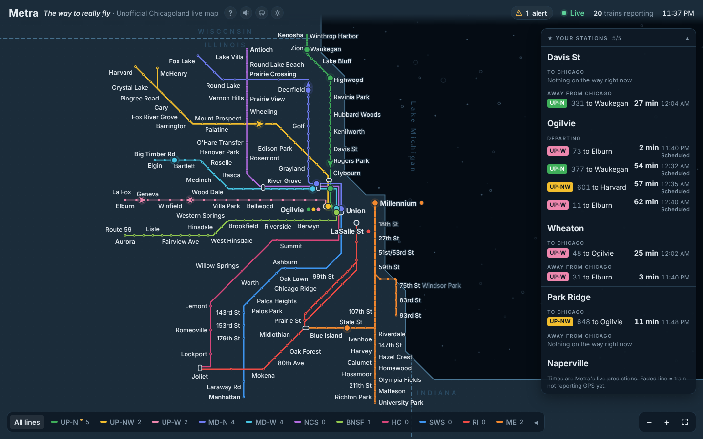
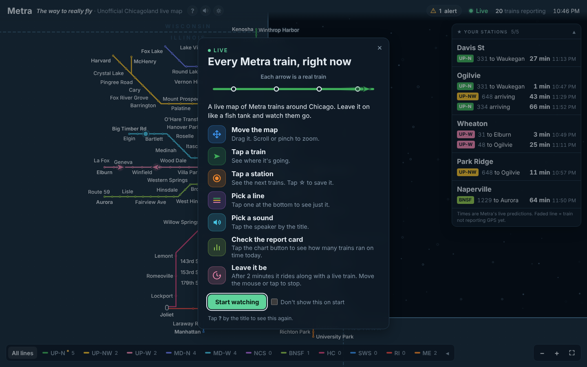
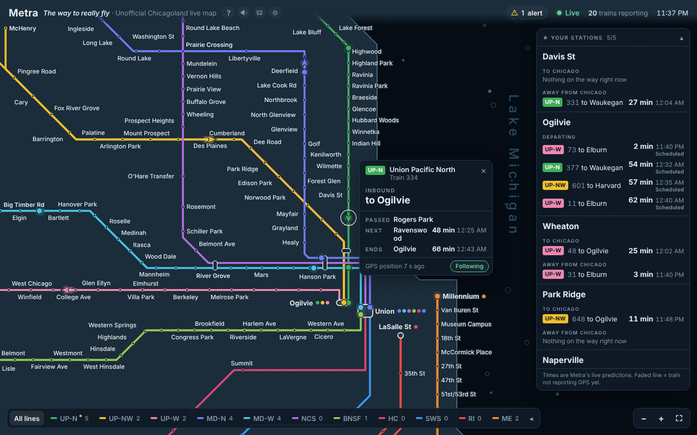
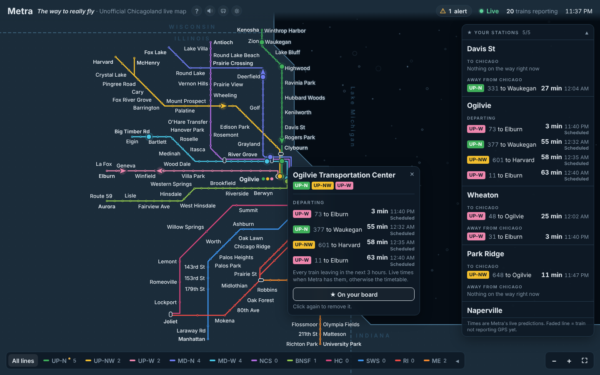
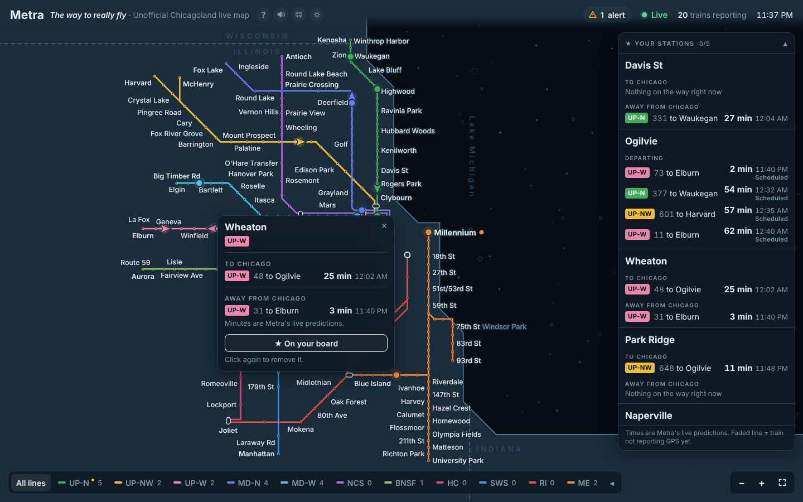
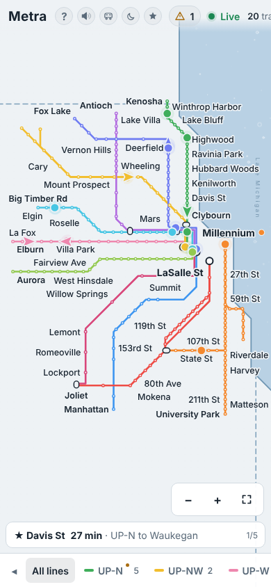
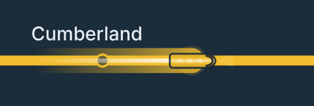
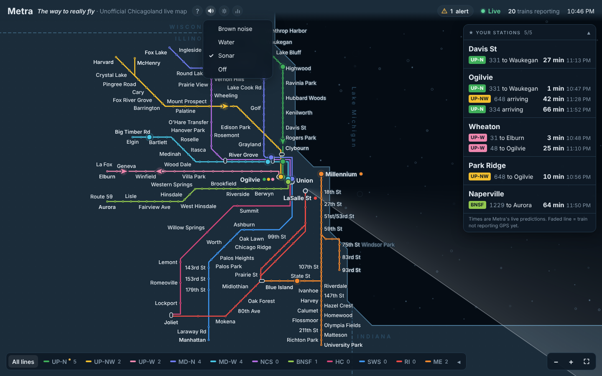
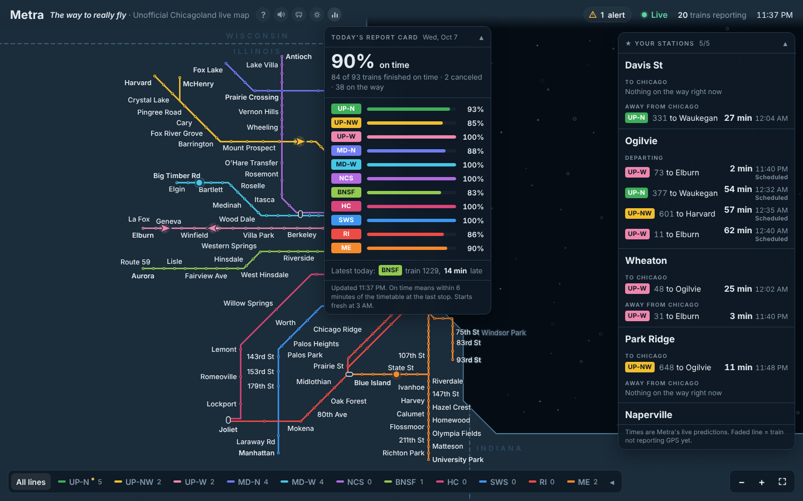
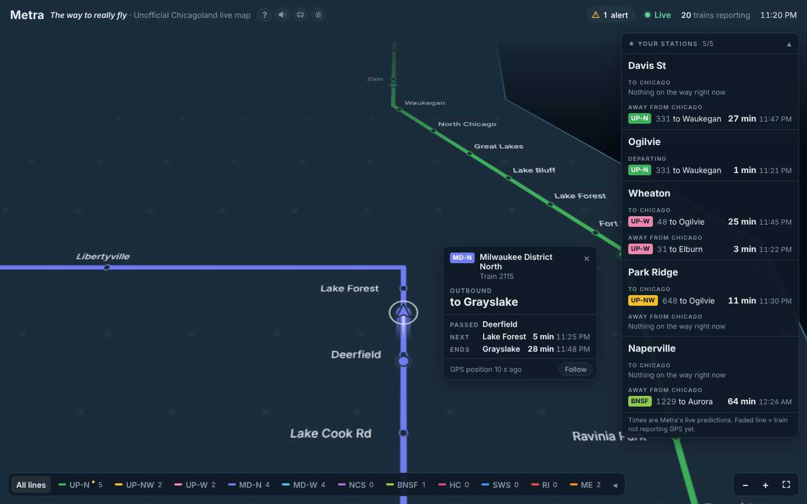

# Metra Live Network

A live map of every Metra train around Chicago. You watch the trains move in real time on a simple, clean diagram of the whole system.

It's made to sit on a second monitor, like a fish tank, but it works on a phone too.

**See it here:** https://evan-dawkins.github.io/metra-live-network/

Screenshots on this page use sample data.

---

## What it does

- Shows all 11 Metra lines and their stations.
- Shows each train as a small arrow that moves as the train moves.
- Click a train or a station to see what's coming and when.
- Shows Metra's service alerts.
- Keeps a report card of how many trains finished on time today.
- Turns into a screensaver called train of the moment (more below).

New here? Click **?** next to the title any time for a quick guide.

### Tap a train

See where it's headed, the station it just passed, and when it reaches the next stop and the end of the line. Press **Follow** to ride along behind it, like train of the moment. Close the card to go back to the whole map.

### Tap a station

See the next trains in each direction, **To Chicago** and **Away from Chicago**, with minutes until they arrive. Both directions always show, even when one has nothing coming yet.

### Downtown departure boards

Tap a downtown station (Ogilvie, Union Station, LaSalle St or Millennium) to see a departure board, like the screen on the station wall. It lists every train leaving in the next 3 hours, with a countdown, even if the train hasn't shown up yet.

Each train has a status:
- **On time** or **7 min late:** Metra has a live time for it.
- **Canceled:** Metra canceled it.
- **Scheduled:** no live news yet, so the time is from the timetable.

Tap ☆ to save a station to your board on the right. The board shows the same thing for each saved station.

### On your phone

Everything works on a phone too. Your saved stations sit in a strip at the bottom.

- Has light and dark mode.
- A quiet line under the title describes what the trains are doing at this hour, like "Morning rush. Most trains are headed downtown." It follows Chicago time and has its own set for weekends.
- Can show little trains instead of arrows. Click the train button next to the title, or press **C**. They look like model trains seen from above, in their line's color, and sway gently while they're moving.

## Sounds

Click the speaker button next to the title to pick one:

| Sound | What it is |
|---|---|
| **Brown noise** | A soft, steady hush. |
| **Water** | Gentle moving water with the odd bubble. |
| **Sonar** | A deep underwater rumble. A radar sweeps over the map once every 30 seconds, and a soft ping plays each time fresh train data comes in. |
| **Off** | No sound. |

The page remembers your pick. Press **M** to mute or unmute. Sound starts after your first click, because browsers don't allow it before that.

## Report card

The bar-chart button next to the title opens today's report card: the share of trains that finished on time, line by line, and the latest train of the day.

A train counts as on time if it reaches its last stop within 6 minutes of the timetable. That's Metra's own rule. The card keeps counting all day, even when the page is closed, and starts fresh at 3 AM.

## Train of the moment

Leave the page alone for 2 minutes and it turns into a screensaver:

1. The camera zooms in behind a live train. The map turns so the train points up and tilts back in 3D, as if you're riding along.
2. A card pops up with the train's details: its line, number, where it's headed, and its next stop with Metra's times.
3. After about a minute it pulls back to the whole map, rests for a bit, then picks another train.

Move the mouse, tap or press a key and the normal map comes right back. On phones the map turns but doesn't tilt. If your device is set to reduce motion, the screensaver stays off.

## Is the data real?

Yes. Everything comes straight from Metra's live feeds. Nothing is guessed or made up.

If Metra doesn't give a time for something, the map says so instead of inventing one. If the live data can't load, you can choose to see pretend trains, and they're clearly labelled "Simulated."

## How it works (the simple version)

1. Metra publishes live train data, but in a format your browser can't read directly.
2. A tiny program on Cloudflare (`worker.js`) grabs that data, turns it into something readable, and keeps your Metra key secret.
3. The page (`index.html`) asks that program for the data every 30 seconds and draws the map.
4. For the report card, the Cloudflare program also checks every 2 minutes on its own. It compares each finished train with Metra's timetable, which GitHub downloads fresh every night. The downtown departure boards use that same timetable.

That's it. There's nothing to install and no build step.

## Files

| File | What it is |
|---|---|
| `index.html` | The whole map, in one file |
| `worker.js` | The Cloudflare program that fetches Metra's data (a backup copy; Cloudflare runs the real one) |
| `schedule.json` | Metra's timetable, shrunk down to what the report card and departure boards need (updated nightly, automatically) |
| `tools/build_schedule.py` | Makes `schedule.json` from Metra's timetable |
| `.github/workflows/timetable.yml` | Tells GitHub to run that every night |
| `docs/` | The screenshots on this page |
| `README.md` | This page |

## Make your own copy

1. **Get a free Metra key** at [metra.com/developers](https://metra.com/developers).
2. **Make a Cloudflare Worker.** Paste in `worker.js` and click Deploy.
3. **Add your key to it.** In the Worker's settings, add a secret named `METRA_API_TOKEN` and paste your key. It stays in Cloudflare and never goes in this repo.
4. **Point the page at your Worker.** In `index.html`, change `WORKER_URL` to your Worker's address.
5. **Put it online.** In this repo, go to Settings → Pages, pick the `main` branch and `/ (root)`, and save.
6. **Turn on the report card (optional).** In Cloudflare, make a KV storage space and connect it to the Worker with the name `REPORT`. Then add a Cron Trigger set to `*/2 * * * *` (every 2 minutes). If you made your own copy, change `SCHEDULE_URL` in `worker.js` to your site's address.

## Updating it

Upload or push a new `index.html` to the `main` branch. The site updates in about a minute. If you still see the old version, refresh with **Ctrl + Shift + R** (Mac: **Cmd + Shift + R**).

## Good to know

- It covers Metra only, not CTA trains.
- This is an independent project and isn't affiliated with Metra.
