# MetraBot

MetraBot is a live map of every Metra train in Chicagoland, moving in real time on a clean diagram of the whole system.

It's built to sit on a second monitor like an aquarium: calm, quiet, and fun to glance at. It works just as well on your phone.

**Open it:** https://evan-dawkins.github.io/metrabot/

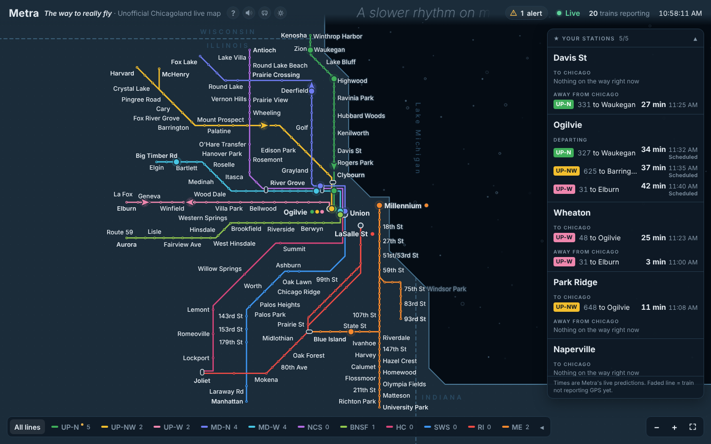

Screenshots on this page use sample data.

---

## What you get

- **Every train, live.** All 11 lines, with each train placed from its own GPS report and updated about every 30 seconds.
- **Station times.** Tap a station to see the next trains toward Chicago and away from it.
- **Departure boards** for the four downtown stations, like the screen on the station wall.
- **Your stations.** Pin up to 5 and they stay on screen.
- **A daily report card** showing how many trains ran on time.
- **A calm ticker** in the top bar that describes what the trains are doing right now.
- **Train of the moment,** a screensaver that rides along behind a live train, with a soft voice checking in on it.
- **Ambient sound:** brown noise, water, or a sonar radar.
- **Little trains** instead of arrows, if you like.
- **Light and dark mode.**
- **Made for phones too,** upright or sideways.

New here? Click **?** next to the title any time for a quick guide.

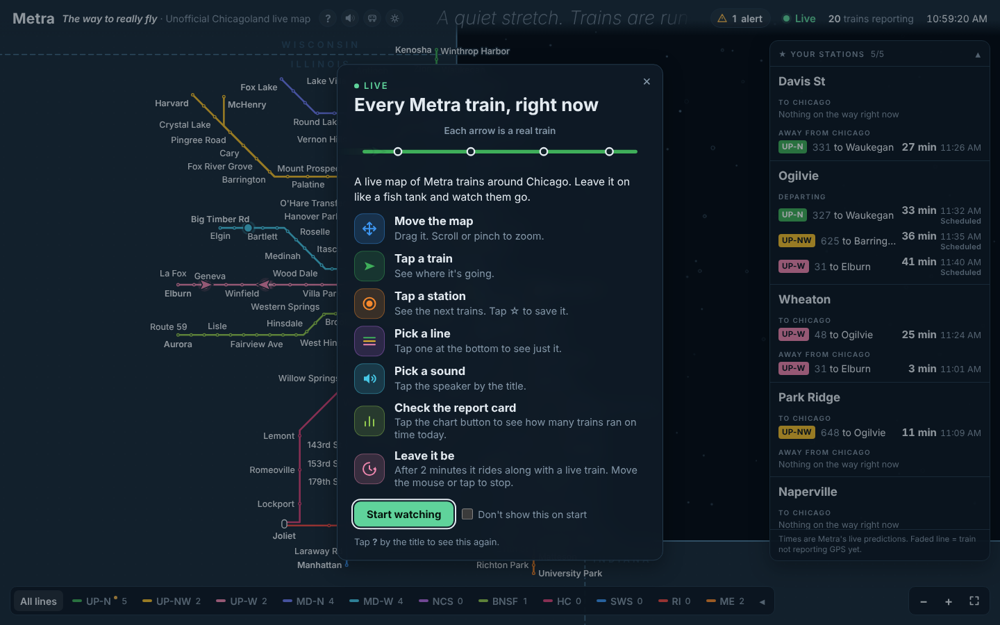

## Getting around

| To do this | On a computer | On a phone |
|---|---|---|
| Move the map | Drag | Drag with one finger |
| Zoom | Scroll, or **+** / **−** | Pinch |
| See the whole network | **⛶** button, or **0** | **⛶** button |
| Show just one line | Click it in the bottom bar | Tap it in the bottom bar |
| Fold the line bar | Click **All lines** | Tap **All lines** |
| Close a card | **Esc**, or click the map | Tap the map |

**Keyboard shortcuts:**
- **?** opens the guide
- **M** mutes sound
- **T** switches light and dark mode
- **C** switches arrows and little trains

## Trains

Click a train to see:
- its line and train number
- where it's headed
- the station it just passed
- when it reaches the next stop and the end of the line

Press **Follow** to ride along behind it. The map turns so the train points up and tilts back in 3D. Close the card to glide back to the whole network.

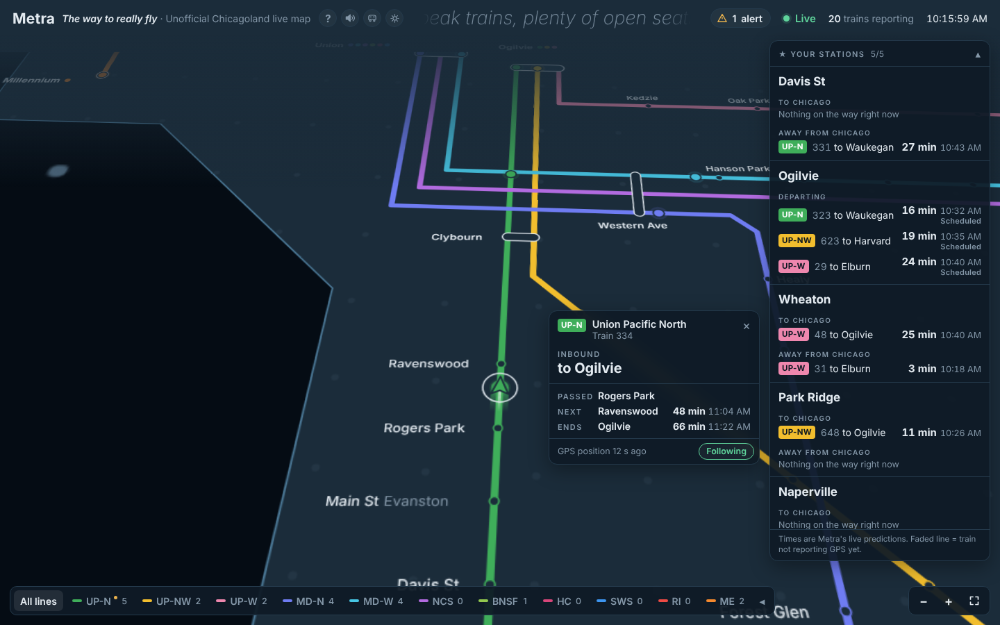

## Stations

Click a station to see the next trains **To Chicago** and **Away from Chicago**, with minutes until they arrive. Both directions always show, even when one has nothing coming yet.

Tap **☆** to pin the station to your board on the right. On a phone, your stations sit in a strip at the bottom.

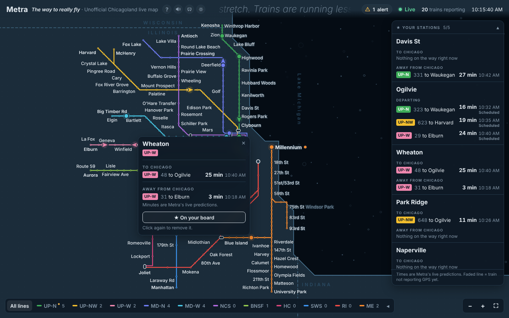

### Downtown departure boards

Ogilvie, Union Station, LaSalle St and Millennium show a departure board instead: every train leaving in the next 3 hours, with a countdown, even before the train has shown up.

Each departure has a status:
- **On time** or **7 min late:** Metra has a live time for it.
- **Canceled:** Metra canceled it.
- **Scheduled:** no live news yet, so the time comes from the timetable.

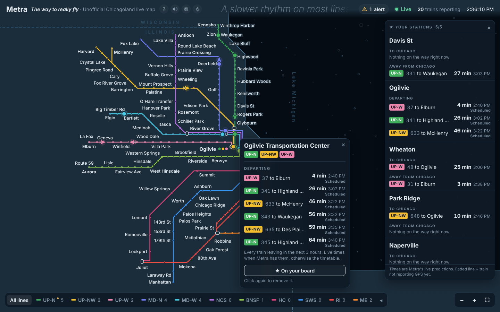

## The ticker

A line of text drifts slowly across the top bar, describing what's happening on the rails right now. It reads the live map and compares it with Metra's timetable, so it can tell more than the time of day:
- **Rush hour:** when the trains are actually busy, and which way they're headed
- **Delays:** trains running late overall, or one line in trouble, e.g. "Delays on the BNSF right now"
- **Unusual days:** extra trains for a game or event, or a holiday-style day
- **Late night:** the night's last trains leaving soon

It shows a new line every 10 minutes, or right away when something changes. If the live data drops, it falls back to lines based on the time of day.

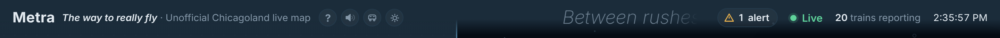

## Report card

The **bar-chart button** next to the title opens today's report card: the share of trains that finished on time, line by line, plus the latest train of the day.

A train counts as on time if it reaches its last stop within 6 minutes of the timetable, Metra's own rule. The card keeps counting all day, even when nobody has the page open, and starts fresh at 3 AM.

If live data was missing for a while, the card says so, and trains timed by GPS instead are noted.

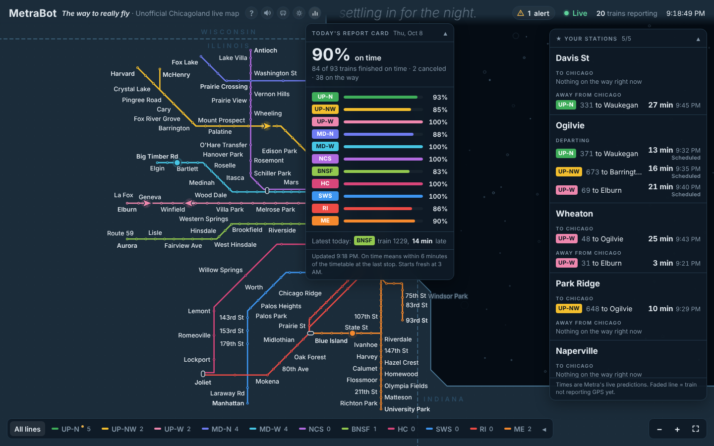

## Train of the moment

Leave the page alone for 2 minutes and it turns into a screensaver:

1. The camera swoops in behind a live train, turning and tilting the map so you're riding along.
2. The train's card pops up with where it's headed and its next stop.
3. A soft voice **checks in** on the train.
4. After about a minute it pulls back to the whole map, rests, then picks another train.

It keeps going until you close the train's card with **×**. Moving the mouse, scrolling or pressing keys won't stop it. On phones the map turns but doesn't tilt. If your device is set to reduce motion, the screensaver stays off.

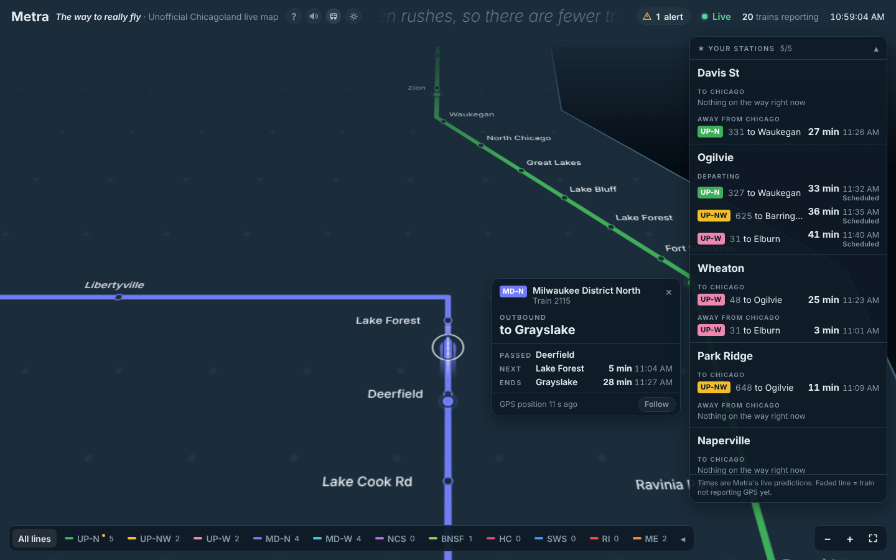

### Train check-ins

Like a weather stream checking in on a live camera, the voice checks in three times per ride:

| When | What it says |
|---|---|
| **The ride starts** | Which line and direction, how it's running, and the next stop. *"Checking in on an inbound Union Pacific North train. It's running about two minutes behind. Next up, Ravenswood, in about three minutes."* |
| **Halfway** | Where it just was and where it ends up. *"Just passed Rogers Park. The last stop is Ogilvie, in about fifteen minutes."* |
| **The ride ends** | A short sign-off. *"That's the check-in. Back out to the full map."* |

- Everything it says comes from Metra's live data, the same as the train's card.
- The background sound dips while it talks.
- Turn it on or off in the **speaker** menu → **Train check-ins**. The page remembers your choice.
- It only checks in during train of the moment, never on a train you picked yourself.
- Like all sound, the voice starts after your first click.

The voice is free: every phrase was recorded once ahead of time with [Kokoro](https://github.com/thewh1teagle/kokoro-onnx), an open-source voice, and the page stitches the pieces together.

## Sounds

Click the **speaker** next to the title to pick one:

| Sound | What it is |
|---|---|
| **Brown noise** | A soft, steady hush. |
| **Water** | Gentle moving water with the odd bubble. |
| **Sonar** | A deep underwater rumble. A radar sweeps the map once every 30 seconds and gives a soft, low ping when fresh train data arrives. |
| **Off** | Silence. |
| **Train check-ins** | A separate on/off switch at the bottom of the menu for the voice that checks in during train of the moment. See above. |

The page remembers your pick. Sound starts after your first click, because browsers don't allow it before that. On iPhone and iPad, the silent switch mutes it.

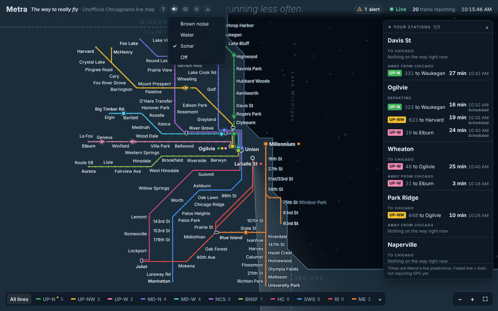

## Little trains

Click the **train button** next to the title, or press **C**, to swap the arrows for little trains. They look like model trains seen from above, in their line's color, and sway gently while they're moving.

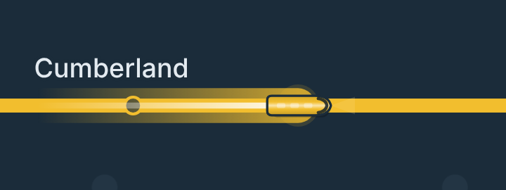

## On your phone

Open the same link on your phone. Everything works there, sized for one hand:

1. **The map fills the screen.** Drag with one finger, pinch to zoom.
2. **Cards slide up from the bottom.** The map moves so the train you picked stays in view above its card, even when you press **Follow**.
3. **The ticker** gets its own slim line under the buttons.
4. **Your stations** sit in a strip at the bottom. Tap it to see them all.
5. **Lines:** swipe the bottom bar sideways to pick one.

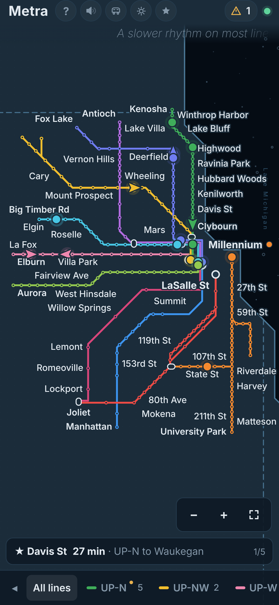
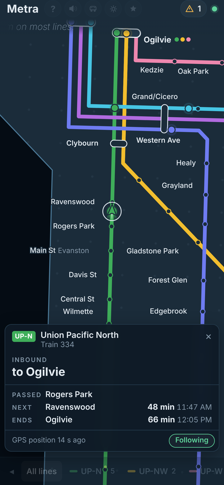
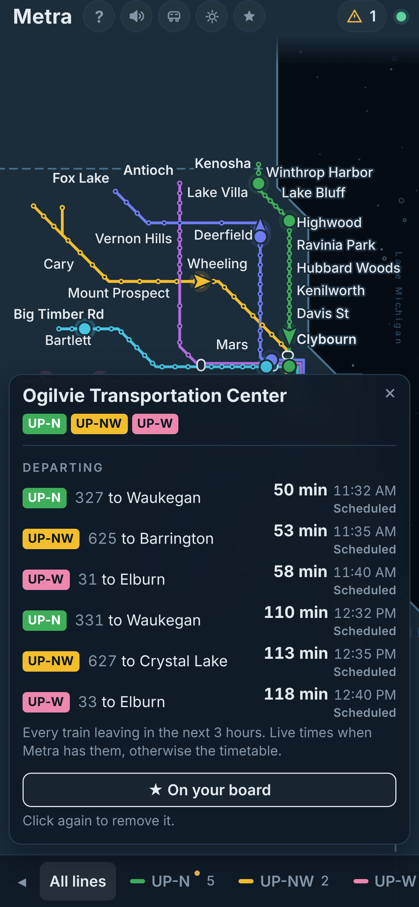
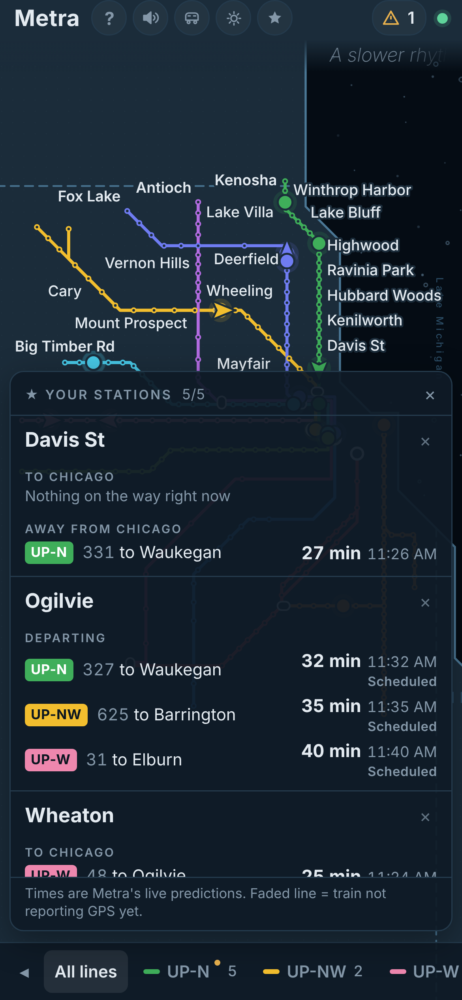

**Turn your phone sideways** and cards move to the left side, so the map stays open on the right.

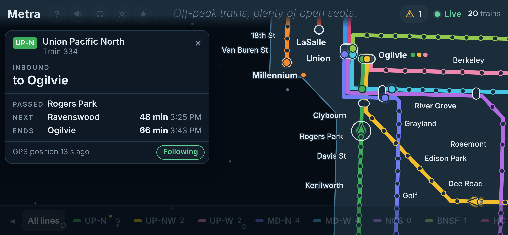

**Tip:** add it to your home screen (Safari: Share → **Add to Home Screen**; Chrome: ⋮ → **Add to Home screen**) and it opens like an app.

## Light mode

Click the **sun** button, or press **T**.

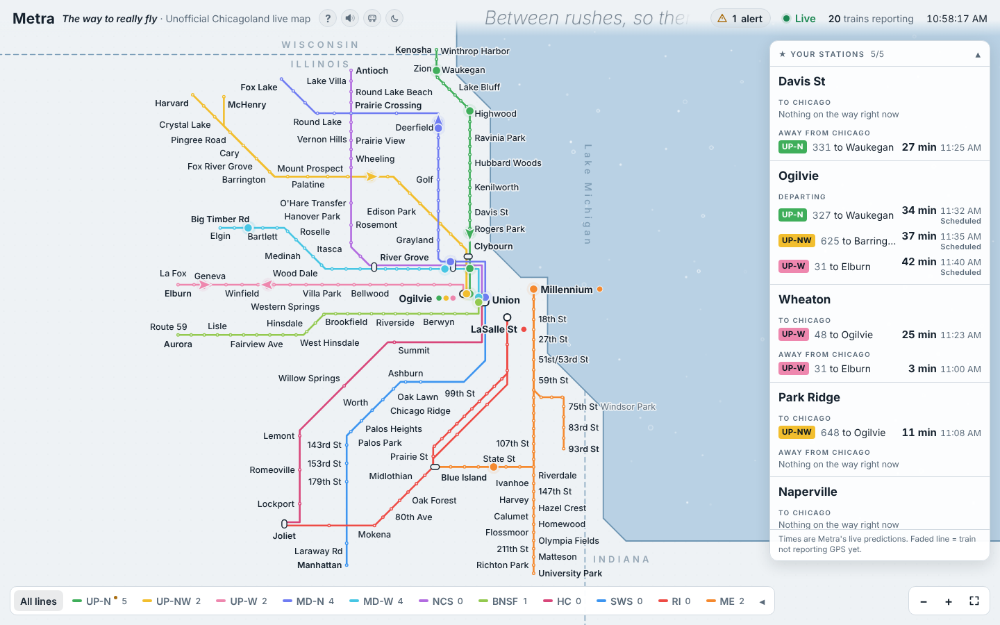

## Is the data real?

Yes. Train positions, times, alerts and cancellations come straight from Metra's live feeds, and scheduled times come from Metra's published timetable. Nothing is guessed.

If Metra doesn't have a time for something, the map says so instead of inventing one. If the live data can't load, you can choose to watch pretend trains, and they're clearly labeled "Simulated".

## How it works

1. Metra publishes live train data in a format browsers can't read directly.
2. A small program on Cloudflare (`worker.js`) fetches it, turns it into something readable, and keeps the Metra key secret. Visitors share its answers, so Metra is only asked about every 25 seconds no matter how many people are watching.
3. The page (`index.html`) asks that program for fresh data every 30 seconds and draws the map.
4. Every 2 minutes, the Cloudflare program also scores finished trains for the report card, whether or not the page is open.
5. Every night, GitHub downloads Metra's timetable and saves the parts this map needs (`schedule.json`). The departure boards, the report card and the ticker all use it.

There's nothing to install and no build step.

## Files

| File | What it is |
|---|---|
| `index.html` | The whole map, in one file |
| `worker.js` | The Cloudflare program that fetches Metra's data. This is a backup copy; Cloudflare runs the real one |
| `schedule.json` | Metra's timetable, trimmed down to what the map needs. Updated nightly, automatically |
| `tools/build_schedule.py` | Builds `schedule.json` from Metra's timetable |
| `.github/workflows/timetable.yml` | Tells GitHub to run that every night |
| `voice/` | The recorded check-in voice, packed into a few audio files |
| `tools/build_voice.py` | Records the check-in voice (only needed if you change what it says) |
| `docs/` | The screenshots on this page |
| `README.md` | This page |

## Make your own copy

1. **Get a free Metra key** at [metra.com/developers](https://metra.com/developers).
2. **Make a Cloudflare Worker,** paste in `worker.js`, and click **Deploy**.
3. **Add your key to it.** In the Worker's settings, add a secret named `METRA_API_TOKEN` and paste your key. It stays in Cloudflare and never goes in this repo.
4. **Point the page at your Worker.** In `index.html`, change `WORKER_URL` to your Worker's address.
5. **Put it online.** In this repo, go to **Settings → Pages**, pick the `main` branch and `/ (root)`, and save.
6. **Turn on the report card (optional).** In Cloudflare, create a KV storage space and connect it to the Worker as `REPORT`. Then add a Cron Trigger of `*/2 * * * *` (every 2 minutes). If this is your own copy, change `SCHEDULE_URL` in `worker.js` to your site's address.

## Updating it

Push a new `index.html` to the `main` branch, or upload it on GitHub. The site updates in about a minute. If you still see the old version, refresh with **Ctrl + Shift + R** (Mac: **Cmd + Shift + R**).

Changes to `worker.js` need to be pasted into Cloudflare too, since GitHub only holds a backup copy.

## Good to know

- It covers Metra only, not CTA trains.
- It's an independent fan project and isn't affiliated with Metra.
